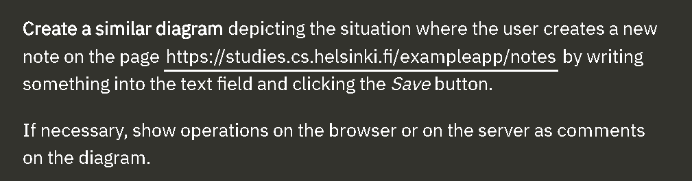
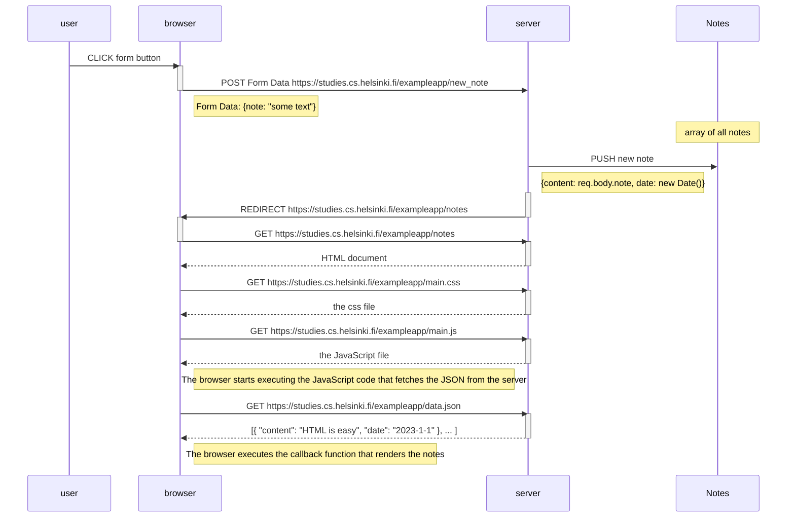

## Instructions: 

## Diagram

```mermaid
sequenceDiagram
    participant user
    participant browser
    participant server

    user->>browser: CLICK form button
    activate browser
    browser->>server: POST Form Data https://studies.cs.helsinki.fi/exampleapp/new_note
    deactivate browser
    Note right of browser: Form Data: {note: "some text"}
    Note over Notes: array of all notes
    server->>Notes: PUSH new note
    Note right of server: {content: req.body.note, date: new Date()}
    activate server
    server->>browser: REDIRECT https://studies.cs.helsinki.fi/exampleapp/notes
    deactivate server
    activate browser
    browser->>server: GET https://studies.cs.helsinki.fi/exampleapp/notes
    deactivate browser
    activate server
    server-->>browser: HTML document
    deactivate server

    browser->>server: GET https://studies.cs.helsinki.fi/exampleapp/main.css
    activate server
    server-->>browser: the css file
    deactivate server

    browser->>server: GET https://studies.cs.helsinki.fi/exampleapp/main.js
    activate server
    server-->>browser: the JavaScript file
    deactivate server

    Note right of browser: The browser starts executing the JavaScript code that fetches the JSON from the server

    browser->>server: GET https://studies.cs.helsinki.fi/exampleapp/data.json
    activate server
    server-->>browser: [{ "content": "HTML is easy", "date": "2023-1-1" }, ... ]
    deactivate server

    Note right of browser: The browser executes the callback function that renders the notes
```
