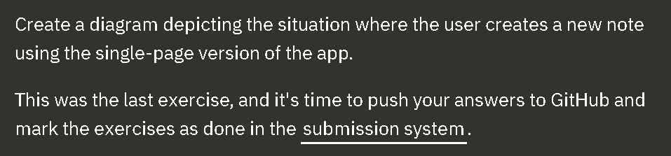
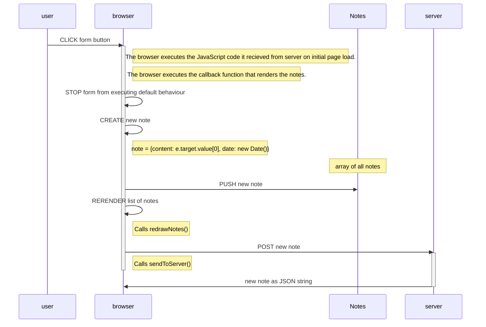

## Instructions: 

## Diagram

```mermaid
sequenceDiagram
    participant user
    participant browser

    user->>browser: CLICK form button
    activate browser
    Note right of browser: The browser executes the JavaScript code it recieved from server on initial page load.
    Note right of browser: The browser executes the callback function that renders the notes.
    browser->>browser: STOP form from executing default behaviour
    browser->>browser: CREATE new note
    Note right of browser: note = {content: e.target.value[0], date: new Date()}
    Note over Notes: array of all notes
    browser->>Notes: PUSH new note
    browser->>browser: RERENDER list of notes
    Note right of browser: Calls redrawNotes()
    browser->>server: POST new note
    activate server
    Note right of browser: Calls sendToServer()
    deactivate browser
    server->>browser: new note as JSON string
    deactivate server
```
