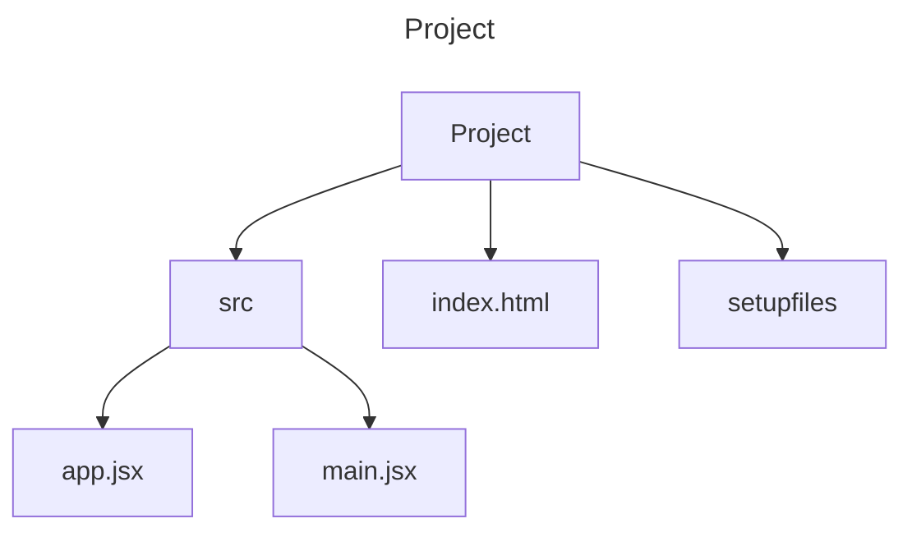

### Introduction to React
#### create-react-app
Easiest way to start with the React Library is with a tool called ***Vite***.

#### component
React is a library that helps in writing almost all of the HTML of our website in terms of JS code.

A barebones React project is made up of the following:


>[!info]- Explanation of Barebones Project
>* ***src*** contains all the code that uses JS to generate HTML elements
>* app.jsx is a **component** that defines a part of the content generated on the webpage
>* main.jsx points to the main wrapper of the content showing up on the webpage
>* index.html contains the base HTML code that references main.jsx, i.e. the main wrapper containing all the content that will show up on the webpage
>* setupfiles are configuration files generated upon project initialization


The **app.jsx** react component is referenced on the final line of the file ***main.jsx*** :
```js
// main.jsx
ReactDOM.createRoot(document.getElementById('root')).render(<App />)
```

Then this line is referenced in **index.html** :
```html
<!doctype html>
<html lang="en">
  <head>
    <meta charset="UTF-8" />
    <link rel="icon" type="image/svg+xml" href="/vite.svg" />
    <meta name="viewport" content="width=device-width, initial-scale=1.0" />
    <title>Vite + React</title>
  </head>
  <body>
    <div id="root"></div>
    <script type="module" src="/src/main.jsx"></script>
  </body>
</html>
```

The **app.jsx** component looks like the following:
```js
//app.jsx
const App = () => {
	return(
	  <div>
	    <p>Hello world</p>
	  </div>
	)
}

export default App
```

The component is contained in a constant variable named *App* and is defined as an arrow function. We can define functions normally as well, i.e.
>[!example]- Normal Functions
>
```js
function App() {

	return (
		<div>
			<p> Hello World</p>
		</div>
	)
}
```

However, arrow functions are more commonly used.

###### JS Code in React Components
Here the function contains only HTML elements. However, it can also contain any kind of JS code.
>[!example]- Any JS Code in React Component
>```js
>const App = () -> {
>	console.log('Hello from component')
>	return (
>		/<div/> 
>			/<p/>Hello World/<p/>
>		/<div/>
>	)
>}
>
>export default App
>```
>This piece of code logs the statement in the console while rendering the HTML of the webpage.

###### First Rule of Frontend Web Development
>[!tip] Keep the console open at all times!

###### Dynamic Content Inside Components
You can render dynamic content inside components by writing JavaScript within the HTML content inside the return statement by using curly braces.
>[!example]- Any JS Code in React Component
>```js
>const App = () -> {
>	const now = new Date()
>	const a = 10
>	const b = 20
>	console.log(now, a+b)
>	return (
>		/<div/> 
>			/<p/>Hello World, it is {now.toString()}/</p/>
>			/<p/> 
>				{a} plus {b} is {a+b}
>			/</p/>
>		/</div/>
>	)
>}
>
>export default App
>```
>Any code within curly braces is evaluated and the result is embedded into the defined place in the HTML produced b the component.

###### Export Statement
The very last line in the component exports the component so the main file can access it. Without it, the entire app will break down.

>[!example]- Export Statement
>```js
>export default App
>```

>[!warning] A React Component must ALWAYS start with a capital letter. For example, `App` is a valid react component name but `app` is not!

#### JSX
Even thought it seems React components return HTML, it is actually JSX. 
JSX looks like HTML but it is simply a way to write HTML components in JavaScript.
Once React components are returned they are compiled into JavaScript. The compilation is handled by **Babel**. 
>[!example]- JSX being compiled into JS
>The last example dynamic content in JSX would be compiled to the following once the JSX is returned:
>```js
>const App = () => {
>	const now = new Date()
>	 const a = 10
>	 const b = 20
>	 return React.createElement(
>		  'div',
>		  null,
>		  React.createElement(
>		  'p', null, 'Hello world, it is ', now.toString()
>		  ),
>		  React.createElement(
>		  'p', null, a, ' plus ', b, ' is ', a + b
>		  )
>	)
>}
>```

JSX is much like HTML with the added distinction of embedding dynamic content with JavaScript within curly braces but is also XML-like in the sense that every tag, even empty or self-closing tags, needs to be closed in JSX.
For example,
```<br>``` is self closing in HTML but in JSX you would need to do ```<br />``` for the  tag to be valid.

#### Multiple Components
It is possible to include multiple components within a file.
For example, we could modify the **app.jsx** component as such:

```js 
const Hello = () => {
  return (
    <div>
      <p>Hello world</p>
    </div>
  )
}

const App = () => {
  return (
    <div>
      <h1>Greetings</h1>

      <Hello />
    </div>
  )
}

export default App
export default Hello
```
This makes it so now we have a component called *Hello* embedded within the component *App*. We can also repeat a component multiple times:
```js
const App = () => {
  return (
    <div>
      <h1>Greetings</h1>
      <Hello />

      <Hello />
      <Hello />
    </div>
  )
}
```

>[!warning] If we pass in multiple components such as `<h1>` and `<Hello />` to a return statement, they both must be wrapped in a parent element. That is, in the end, only **ONE** parent element with **NO SIBLING ELEMENTS** must be getting returned by the component. Otherwise, React will return an error message.

>[!tip] If you don't want to wrap your elements in a parent element such as a `div` tag, you can simply wrap them around a `fragment` tag defined by a tag that represents an empty element.
>```js
><>
>	{components} 
></>
>```
#### Props: passing data to components
We can pass data to components using **props**. Props can be thought of as function arguments; however, they are much more complex than that.
As an example, let's pass a prop to our *Hello* component and then call it from our *App* component.
```js
const Hello = (props) => {
  return (
    <div>

      <p>Hello {props.name}</p>
    </div>
  )
}

const App = () => {
  return (
    <div>
      <h1>Greetings</h1>

      <Hello name='George' />
      <Hello name='Daisy' />
    </div>
  )
}
export default App
export default Hello
```
Here we pass a prop called 'name' to our *Hello* component by referencing it in the instance of the *Hello* component in our *App* component and then passing a value.

One thing to note is that we can also pass props dynamically or by using JavaScript in curly braces. One such example is show below.
```js
const Hello = (props) => {

  console.log(props)
  return (
    <div>
      <p>

        Hello {props.name}, you are {props.age} years old
      </p>
    </div>
  )
}

const App = () => {

  const name = 'Peter'
  const age = 10

  return (
    <div>
      <h1>Greetings</h1>

      <Hello name='Maya' age={26 + 10} />
      <Hello name={name} age={age} />
    </div>
  )
}

export default App
export default Hello
```

#### ESLint Error
An ESLint error warning of a prop missing in props validation my pop up. However, it is not an error but just a warning. It can be disabled by adding the following line to the *.eslint.cjs* file: ```'react/prop-types': 0```.

#### Do Not Render Objects
We can render variables using curly braces in JSX and those variables can be of various types such as integers, strings, booleans, lists, arrays, and more. However, objects do not render the same way as the other variable types in JSX as they have multiple keys and values associated with each item in the object. 

A way to render them is to reference them in the following manner:
```js
const App = () => {
  const friends = [
    { name: 'Peter', age: 4 },
    { name: 'Maya', age: 10 },
  ]

  return (
    <div>
      <p>{friends[0].name} {friends[0].age}</p>
      <p>{friends[1].name} {friends[1].age}</p>
    </div>
  )
}

export default App
```